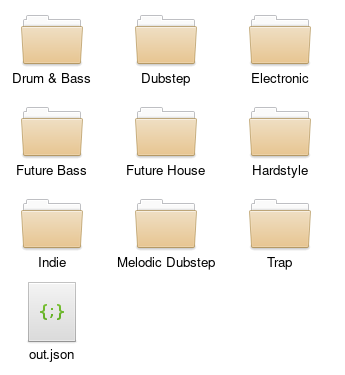

# NCS Crawler

## Features

Collect no copyright sounds on ncs.io

And when download fully proccessed, it will classify those files by moods and genres into different folders and make soft links to which has more moods.

For now, it only use aria2 to download

## Usage

It can't be install with pip now, so just get to ncs_crawler folder and use it in cli. 

```
python main.py [OPTIONS] [-a | -o | -p | -m | -d | -r | -e]

-o, --output
save urls as a file, ../Download/out.json as default

-a, --aria2
use rpc to download

-e, --end
set end page

-r, --rpc
rpc url, http://127.0.0.1:6800/jsonrpc as default

-p, --password
rpc secret

-d, --destination
aria download destination, ../Download/ as default

-m, --makelinks
make soft links by json file, ../Download/out.json as default
``` 

## Example

```
python main.py -a -p yourpassword -r https://remotearia2.xyz:6900/jsonrpc -e 4 -o test.json
```




