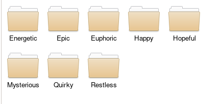

# NCS爬虫

[简体中文](./README_zh.md) | [English](./README.md)

## 效果

收集ncs.io网站上的无版权音乐

当文件全部下载完后，会根据网站提供的情绪和曲风进行分类，多分类时会在每个分类里建立软链接

目前仅支持用aria2下载

## 用法

现在还不能pip直接安装，使用时进入ncs_crawler路径然后在命令行里使用

```
python main.py [OPTIONS] [-a | -o | -p | -m | -d | -r | -e]

-o, --output
将链接、分类等信息存储到文件里，默认是../Download/out.json

-a, --aria2
用aria2 rpc进行下载

-e, --end
设置下载结束的页

-r, --rpc
rpc地址,默认是http://127.0.0.1:6800/jsonrpc

-p, --password
rpc密码

-d, --destination
aria2下载路径,默认是../Download/

-m, --makelinks
生成软链接，可以根据json文件生成, 默认文件为../Download/out.json

-i, --input
通过输入的json文件下载, 默认文件为../input.json
``` 

## 实例

```
python main.py -a -p 你的密码 -r https://remotearia2.xyz:6900/jsonrpc -e 4 -o test.json
```




